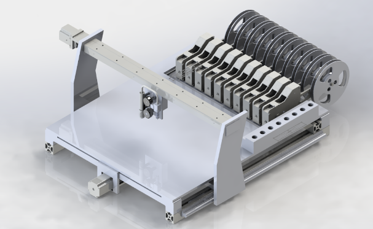
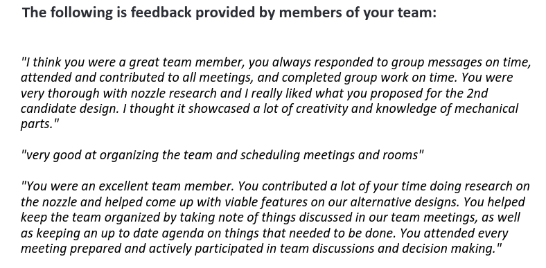
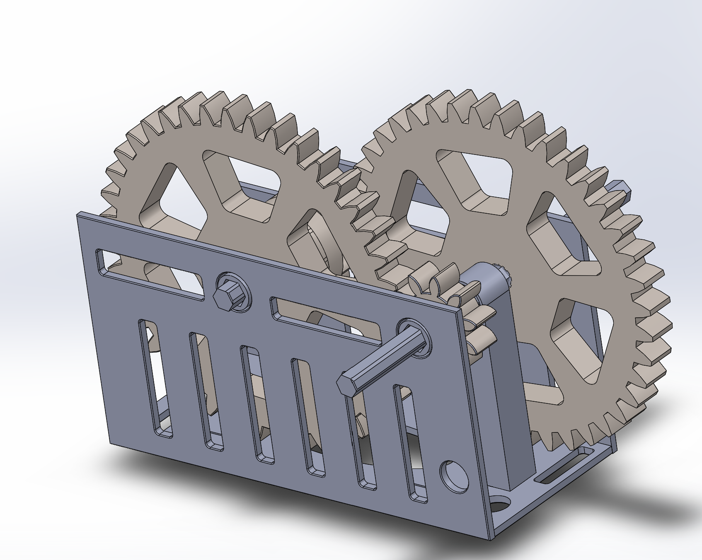
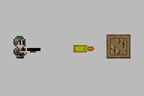
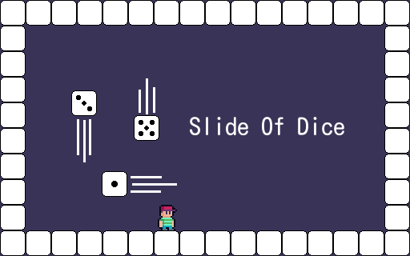

# About Me

Hey there! My name is Parm and I'm working towards earning a Mechanical Engineering degree. I'm a Linux and FOSS enthusiast who likes tinkering around with computers. [Pop!_OS](https://pop.system76.com/) is distro I have been daily driving for about 5 years and I can recommend it to anyone who wants a stable desktop Linux experience. I'm also a enthusiast of many other things as well (Physics, Math, Biology, History, and Geography to name a few) but they're not as easy to talk about digitally like computers are. I would like to make some sort of simulator (simplified) before I finish undergrad to test my understanding of the material I haved learned and dive into computer graphics. 

This website exists to act as both my portfolio and resume. Feel free to contact me with any method scattered across this page.

## Education

### [**BASc. in Mechanical Engineering**](https://www.mie.utoronto.ca/programs/undergraduate/mechanical-engineering/) | University of Toronto 
#### September 2021 - Present

I'm currently in my third year and expecting to graduate in 2026 because of the PEY program. I have chosen the Bioengineering and Mechatronics streams and I plan to pursue minors in Bioengineering and Robotics. 

### **Basic Maching** | George Brown College
#### October 2022

I received basic machine shop training (lathe, milling machine, and drill press) from George Brown College.

## Skills
**CAD:** SOLIDWORKS and Fusion360
 
**Analysis/Simulation:** ANSYS Workbench, SuperSpice, Gazebo, and Minitab
 
**Programming:** Python, C/C++, GDScript, Matlab, C#, Java, and Lua
 
**Office:** Microsoft Office, LibreOffice, Latex, and Adobe Acrobat
 
**Version Control:** Git
 
**Shells:** Bash, Fish, and Zsh
 
**Text Editors:** Vim, NeoVim, LunarVim, Nano, VSCode, and VSCodium
 
**Operating Systems:** Linux, Windows, and MacOS
 
**Other Computer:** ROS, Godot, NumPy, QEMU, Docker, VirtualBox, Markdown, and Arduino
 
**Machining:** Lathe, Mill, and Drill Press

## Certifications

### SOLIDWORKS Associate in Mechanical Design
**ID:** C-NBG6RTS4QA

# Experience

## Robotics For Space Exploration (RSX)

### Arm Control Software Lead | September 2022 - Present
<video src="videos/Ik_features.mp4" controls="controls" muted="muted" style="max-height:640px;" width="480"> 
</video>

- Developed ROS nodes for analytic inverse kinematics of a 6 degree of freedom arm and arm
visualization
- Constructed and visualized 2022 and 2023 arm URDF's 
- Exploring robot path planning and computer vision algorithims to score even more points in future competitions 
- Collaborating on and generating lists of tasks for members to organize work and meet deadlines
- Presented 2023 arm software introduction with activities to introduce new recruits to the arm software development process

### Arm Team Member | May 2022 - August 2022
- Assembled various components of the arm using hand tools to finsh up arm for 2022 CIRC and university club fair
- Operated soldering iron on Arduino pins
- Created URDF file for 2022 arm
- Explored methods to visualize URDF files in RViz
- Researched PID control systems

## MIE243 Pick and Place Machine Project 
### September 2022 - December 2022

- Documentd discussion topics and results for later use — notes are frequently referred to by team during brainstorming session
- Researched and designed SMT compatiable nozzle tips for pick and place machine 
- Constructed CAD models for interchangeable nozzle tip and nozzle rotation control stepper motor and adapter
- Particiapted in candidate process and final design selection to create a design that best meets the engineering specification
- Presented candidate and final designs with team mates during project check-ins to demonstrate that the team was on the right track

#### Team Feedback

## APS112 Handless Garbage Opener Project | January 2022 - April 2022

- Documented discussion topics and results to be used as future reference — notes taken are frequently refereed by the team to go over past ideas and discussions
- Created and presented final design which discussed final designs, proposed designs, design metrics, experimental measurements, and justifications for final design to client and a crowd of people
- Developed one of the three chosen candidate designs to analyze in depth its pros and cons 
- Applied physics to demonstrate reasoning of final design during presentation to client culminating in client approval and purchasing of design for $2010.00 USD

# Projects

## CAD (Computer Aided Design)

### RSX Arm URDF

Worked on simplified end effector model to facilitate smooth visualization of 2023 arm.

### Gearbox 

Gearbox CAD made for MIE243 assignment.

## Software

### [rsx-rover](https://github.com/rsx-utoronto/rsx-rover) ROS Package — Arm Section

As a member of RSX I have contributed greatly to the software on the rover. Specifically, I developed a ros node that performs analytic inverse kinematics on a 6 degree of freedom arm and integrated the arm visualization system into RViz. The arm visualization shows both the targeted arm position and the position the real arm currently is in. Some other stuff I've worked on or learned are simulation of the arm in Gazebo, depth cameras, PID control, and CAN bus.

Future projects for the arm involve autonomously controlling it using path planning algorithms and sensing the environment using computer vision.

### [Generic Gun Shooter](https://battlemonk345.itch.io/generic-gun-shooter)

Generic Gun Shooter was a submission to the 2023 GMTK game jam that me and a friend developed in Godot. The theme of the jam was "Rolls Reversed" which we interpreted as swapping the rolls of bullet and gun because it's kind of funny. I worked on some art assets and created a Finite State Machine to control the enemy soldiers.

### [Slide of Dice](https://battlemonk345.itch.io/slide-of-dice)

This was my first ever submission to a game jam (the 2022 GMTK game jam to be specific) which I worked on with a friend. The theme of the jam was "Roll of a Dice" which we implemented as solving a platforming problem by rolling dice to act as platforms to reach the end of the level. I worked on the art assets and code of the game.

### Godot Behavior Tree

This project is currently work in progress. I am developing a behavior tree plugin for godot using GDExtension - a tool that let's you write plugins for Godot using C++.